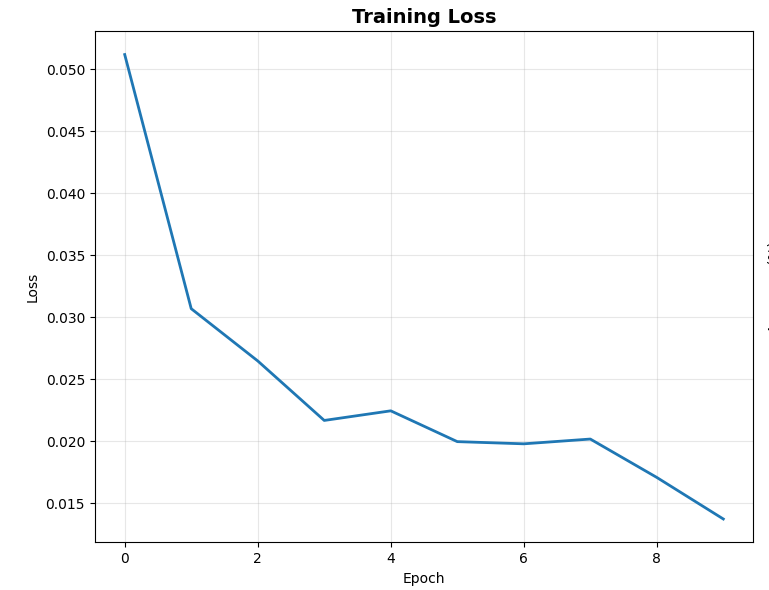
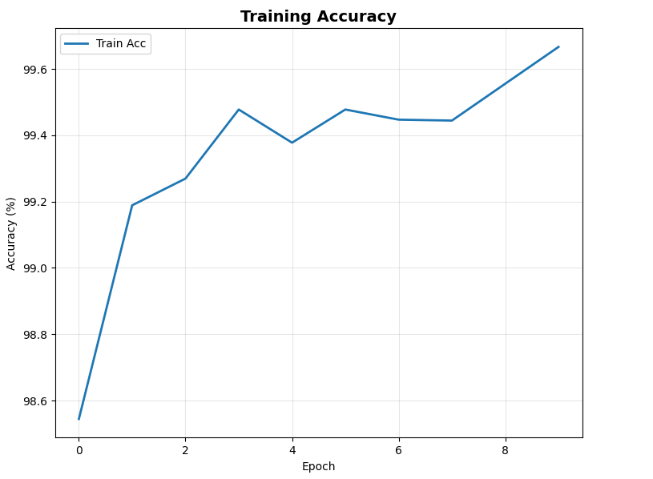
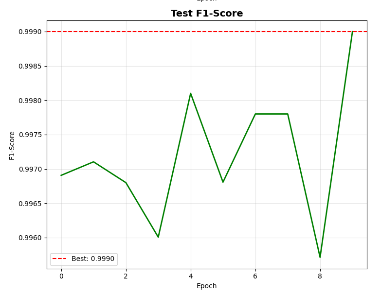

# AI Defect Detection System

Production-grade defect detection for construction materials and textiles using deep learning.


---

## Overview

Deep learning system for automated quality control. Trained on 70,000+ labeled images using ResNet50 architecture.

**Capabilities:**
- Construction materials: Concrete defects, surface irregularities, casting defects
- Textile inspection: Fabric defects, weaving errors (beta)
- Fast inference: 5.5ms per image (ONNX) / 15ms (PyTorch CPU)
- Production ready: ONNX export, Flask API, Streamlit interface

---

## Performance

### Construction Materials

| Metric | Score |
|--------|-------|
| Precision | 99.98% |
| Recall | 99.82% |
| F1-Score | 99.90% |
| Inference | 5.5ms (ONNX CPU) |

**Test Results:** 8,990 correct out of 9,000 held-out images (99.89% accuracy)

### Textiles (Beta)

| Metric | Score |
|--------|-------|
| F1-Score | 90-95% |
| Status | Beta testing |

---

## Training Results






---

## Model Architecture

**ResNet50** with transfer learning:
- Pre-trained on ImageNet
- Modified classification head for binary output
- 24.5M parameters
- Skip connections for better gradient flow

**Input:** 224×224 RGB images  
**Output:** Binary classification (Defective/Good) + confidence score

---

## Installation
```bash
# Clone repository
git clone https://github.com/ihtesham-star/ai_defect_detection.git
cd ai_defect_detection

# Install dependencies
pip install -r requirements.txt
pip install onnxruntime  # For faster inference
```

### Requirements
- Python 3.8+
- PyTorch 2.0+
- torchvision
- onnxruntime
- Pillow, NumPy, scikit-learn

---

## Usage

### PyTorch Inference
```python
from basic_inference import DefectDetector

detector = DefectDetector('best_resnet50_defect_model.pth')

# Single image
result = detector.predict('image.jpg')
print(f"{result['prediction']}: {result['confidence']:.1%}")

# Batch processing
results = detector.predict_batch(['img1.jpg', 'img2.jpg'])
```

### ONNX Inference (2.7x faster)
```python
import onnxruntime as ort
import numpy as np
from PIL import Image

session = ort.InferenceSession("resnet50_defect_detection.onnx")

img = Image.open("test.jpg").resize((224, 224))
img_array = np.array(img).transpose(2, 0, 1).astype(np.float32) / 255.0
img_array = np.expand_dims(img_array, 0)

outputs = session.run(None, {'input': img_array})
prediction = "DEFECTIVE" if np.argmax(outputs[0]) == 0 else "GOOD"
```

---

## Dataset

**Total:** 70,000+ labeled images
- Training: 56,000 (80%)
- Validation: 5,000 (7%)
- Test: 9,000 (13%)

**Sources:**
- Public concrete crack datasets
- Proprietary manufacturing QC data
- Construction site images

**Defect types:**
- Concrete: cracks, spalling, voids, casting defects
- Textiles: tears, weaving errors, pattern defects

---

## Training

**Configuration:**
- Architecture: ResNet50 (transfer learning)
- Optimizer: AdamW (lr=0.0001)
- Scheduler: ReduceLROnPlateau
- Batch size: 32
- Epochs: 10
- Hardware: NVIDIA RTX 5090
- Training time: ~40 minutes

**Data augmentation:**
- Random crops, flips, rotations
- Color jittering
- Perspective transforms
---

## Deployment

### Web Interface (Streamlit)
```bash
streamlit run production_system.py
```

### REST API (Flask)
```bash
python production_system.py --mode api --port 5000
```

### Command Line
```bash
python production_system.py --mode single --image test.jpg
```

---

## Limitations

- Binary classification only (no localization)
- Optimized for controlled lighting
- Construction: production-ready
- Textiles: beta (requires more testing)

---

## Roadmap

- [ ] Defect localization
- [ ] Multi-class categorization
- [ ] Additional material types
- [ ] Mobile deployment
- [ ] Real-time video processing

---

## Citation
```bibtex
@software{hayat2026defect,
  author = {Ihteshamul Hayat},
  title = {AI Defect Detection System},
  year = {2026},
  url = {https://github.com/ihtesham-star/ai_defect_detection}
}
```

---

## License

MIT License - See LICENSE file

---

## Contact
- Email: ihteshamul.hayat@nu.edu.kz
- GitHub: [@ihtesham-star](https://github.com/ihtesham-star)

---

*Last updated: February 2026*